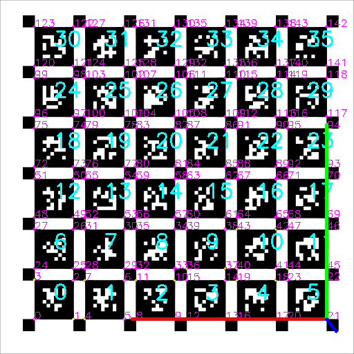
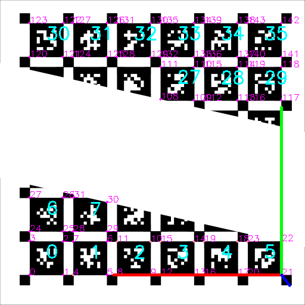

# aprilgrid

A basic C++ library for performing april grid detections and pose estimations using OpenCV


## Build
```bash
mkdir build -p
cd build
cmake ../
cmake --build .
sudo make install
```

## Test
```
./aprilgrid-cpp-test
```


## Using this Library

This library aims to mimic the OpenCV logical steps for fiducial board detection and pose estimation. The AprilGrid object is constructed by defining the tag dictionary as well as information about the grid structure and dimensions.

```c++
auto april_grid = AprilGrid(cv::aruco::DICT_APRILTAG_36h11, 2, 3, 6, 6, 0.1, 0);
```
Given an image, detect all April tags from the current image.

```c++
std::vector<std::vector<cv::Point2f>> corners;
std::vector<int> ids;
april_grid.detectAprilTags(image, corners, ids);
```

The tag corners and IDs are used to create points representing the board in both the board and image coordinate spaces.

```c++
std::vector<cv::Point3f> obj_points;
std::vector<cv::Point2f> img_points;
april_grid.matchImagePoints(corners, ids, obj_points, img_points);
```

The points in these two coordinate spaces are used to find the rotation and translation vectors for the board.

```c++
cv::Vec3d r_vec, t_vec;
cv::solvePnP(obj_points, img_points, camera_matrix_, dist_coeffs_, r_vec, t_vec);
```

Finally, this library provides two drawing functions to visualize the tag detection and reprojection errors.

```c++
cv::Mat image_out;
cv::cvtColor(image, image_out, cv::COLOR_GRAY2BGR);
AprilGrid::drawDetectedTags(image_out, ids, img_points);
AprilGrid::drawReprojectionErrors(image_out, ids, obj_points, img_points, r_vec, t_vec, camera_matrix_, dist_coeffs_);
cv::drawFrameAxes(image_out, camera_matrix_, dist_coeffs_, r_vec, t_vec, 5.0);
```


## Examples
A full board detection:



Or with occlusions:


